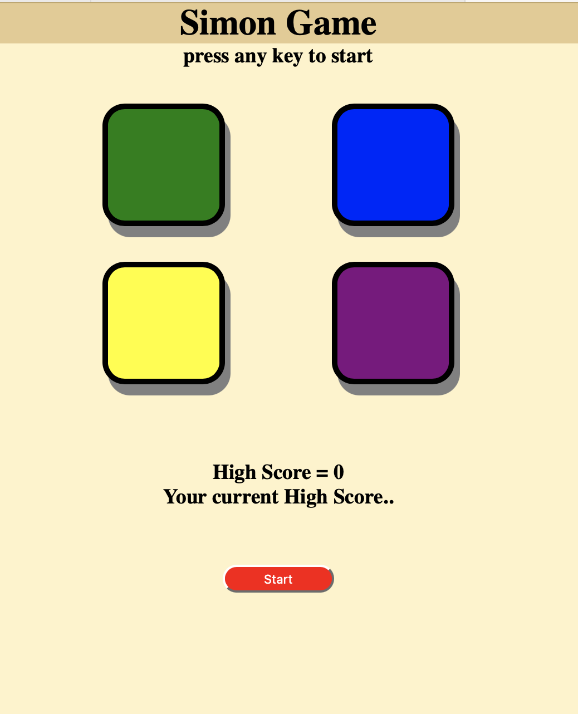

# 🎮 Simon Game

A simple and interactive Simon Game built using **HTML, CSS, and JavaScript**. The game tests your memory by generating an increasingly long sequence of colors that the player must repeat correctly.

## 🚀 Live Demo

🔗 https://simon-game-mini-project-rust.vercel.app

---

## 📌 Features

- 🎯 Classic Simon Game
- 🎨 Four colored buttons
- ✨ Flash animation for game sequence
- 🧠 Memory-based gameplay
- 📈 High Score tracking using Local Storage
- 📱 Responsive and lightweight UI
- ▶️ Start game using button or keyboard

---

## 🛠️ Technologies Used

- HTML5
- CSS3
- JavaScript (ES6)
- Local Storage API

---

## 📂 Project Structure

```
Simon-Game/
│── index.html
│── style.css
│── app.js
│── README.md
```

---

## 🎮 How to Play

1. Click the **Start** button or press any key.
2. Watch the color sequence carefully.
3. Repeat the sequence by clicking the buttons.
4. Each level adds one new color.
5. The game ends if you click the wrong button.
6. Try to beat your highest score!

---

## 📸 Screenshot



---

## 💡 Future Improvements

- 🔊 Sound effects
- 🎵 Background music
- 🌙 Dark Mode
- 📱 Better Mobile UI
- 🏆 Online Leaderboard
- ⏸️ Pause/Resume Feature
- 🎚️ Difficulty Levels

---

## 📚 Concepts Used

- DOM Manipulation
- Event Listeners
- Arrays
- Functions
- setTimeout()
- Random Number Generation
- Local Storage
- Game Logic

---

## 👨‍💻 Author

**Kuldeep Singh**

- GitHub: https://github.com/kuldeepsingh-1128
- LinkedIn: https://www.linkedin.com/in/kuldeep-singh-3b5597372/

---

## ⭐ Support

If you like this project, don't forget to ⭐ star the repository.
